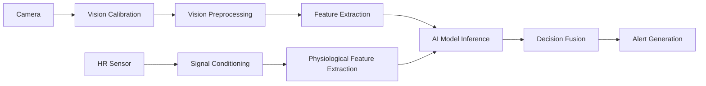

# 3.1 System Architecture

↑ [[03 Methodology]]

The proposed Real-Time Driver Monitoring System (DMS) is designed to enhance road safety by continuously monitoring the driver's behavioural and physiological condition during vehicle operation. The system combines computer vision, physiological sensing, artificial intelligence, and real-time alert mechanisms to detect unsafe driving conditions such as drowsiness, distraction, fatigue, and stress. The overall architecture is centred around a Raspberry Pi processing unit, which receives sensor inputs, performs AI-based analysis, and generates appropriate warning outputs.

> [!info] Figure 3-1
> High-Level Block Diagram of the Proposed Driver Monitoring System *(see original .docx for the figure)*

The behavioural monitoring subsystem is responsible for analysing the driver's visual behaviour using a camera module. The camera continuously captures real-time video frames of the driver and sends them to the Raspberry Pi for processing. Before analysis, the image stream undergoes a calibration stage to compensate for camera position, driver posture, and environmental lighting conditions.

After calibration, preprocessing operations such as image resizing, normalization, frame stabilization, and noise reduction are applied to improve input quality and ensure reliable AI analysis. The processed frames are then passed to the feature extraction stage, where important visual indicators are extracted. These indicators include facial landmarks, eye state, eye-closure duration, gaze direction, head pose, and the presence of distracting objects such as mobile phones. The extracted behavioural features are analysed using AI-based computer vision models that perform drowsiness detection, attention monitoring, and distraction recognition in real time.

## 3.1.1 Physiological Monitoring Subsystem

The physiological monitoring subsystem provides additional information regarding the driver's internal condition using a heart-rate sensor. The sensor continuously captures physiological readings, which are then transmitted to the Raspberry Pi for processing.

The collected physiological signals undergo signal conditioning and preprocessing to remove unstable readings, reduce noise, and handle abnormal sensor values. After preprocessing, physiological features such as heart-rate level, heart-rate spikes, deviation from baseline values, and heart-rate variability (HRV) are extracted and organized as physiological indicators. These extracted features are forwarded to the AI processing stage as supporting information for stress and fatigue analysis.

## 3.1.2 AI Processing and Decision Fusion

The AI processing stage represents the core intelligence of the proposed system. Multiple AI models analyse the processed behavioural and physiological inputs simultaneously. The drowsiness-detection model evaluates eye closure and facial fatigue indicators, while the object-detection model identifies distracting objects and unsafe driving activities. In parallel, the stress/fatigue detection model analyses physiological indicators obtained from the heart-rate sensor.

The outputs generated by all AI models are combined in the decision-fusion stage. This stage determines the final driver condition and evaluates the level of risk based on combined evidence from both sensing modalities. By integrating behavioural and physiological monitoring, the system improves detection accuracy and reduces the likelihood of false alarms compared to single-source monitoring systems.

## 3.1.3 Alert Generation Subsystem

Once the driver's condition has been determined, the system activates the alert generation subsystem to warn the driver according to the detected risk level. The alert mechanism uses both buzzer signals and vibration feedback to restore driver attention and improve response effectiveness.

Different alert patterns are assigned to different driving conditions. Mild distraction or temporary gaze deviation triggers short intermittent buzzer signals, while prolonged eye closure, repeated drowsiness, or severe distraction activates stronger warning patterns with repeated buzzer alerts and vibration feedback. In critical situations involving combined behavioural and physiological risk indicators, the system generates the highest alert level to ensure immediate driver awareness.

## Table 3-1: System Data Flow

| Step | Stage | Description |
| --- | --- | --- |
| 1 | Data Acquisition | Camera and heart-rate sensor capture behavioural and physiological data in real time. |
| 2 | Vision Calibration | The image stream is calibrated according to lighting, camera position, and driver posture. |
| 3 | Vision Preprocessing | Frames are resized, normalized, stabilized, and cleaned for reliable analysis. |
| 4 | Feature Extraction | Visual features such as eye state, gaze direction, and head pose are extracted. |
| 5 | Signal Conditioning | Heart-rate readings are filtered and cleaned to remove unstable values. |
| 6 | Physiological Feature Extraction | Heart-rate indicators and fatigue-related features are extracted. |
| 7 | AI Model Inference | AI models analyse behavioural and physiological inputs simultaneously. |
| 8 | Decision Fusion | Outputs from all AI models are combined to determine the driver state. |
| 9 | Alert Generation | The system activates buzzer and vibration alerts according to risk level. |

The proposed system architecture enables continuous real-time monitoring, intelligent driver-state analysis, and rapid warning generation. By combining behavioural and physiological sensing with AI-based decision fusion, the system improves detection reliability and contributes to reducing road accidents caused by driver fatigue and distraction.

## Table 3-2: Alert Mapping

| Detected Condition | Alert Pattern | Purpose |
| --- | --- | --- |
| Normal Driving | No buzzer | Avoid unnecessary disturbance. |
| Short Distraction or Mild Gaze Deviation | Short intermittent beep | Warn the driver early. |
| Long Eye Closure or Repeated Drowsiness | Repeated buzzer + vibration | Indicate urgent fatigue risk. |
| Phone Usage or Severe Distraction | Continuous buzzer pattern | Force immediate attention recovery. |
| Combined Behavioural and Physiological Risk | Maximum alert + strong vibration | Highlight critical unsafe conditions. |

See also: [[3.2 Technical Description]], [[3.4 Software Hardware Requirements]], [[4.4 Feasibility and Risk Analysis]]

---
← [[03 Methodology]] | Next: [[3.2 Technical Description]]
