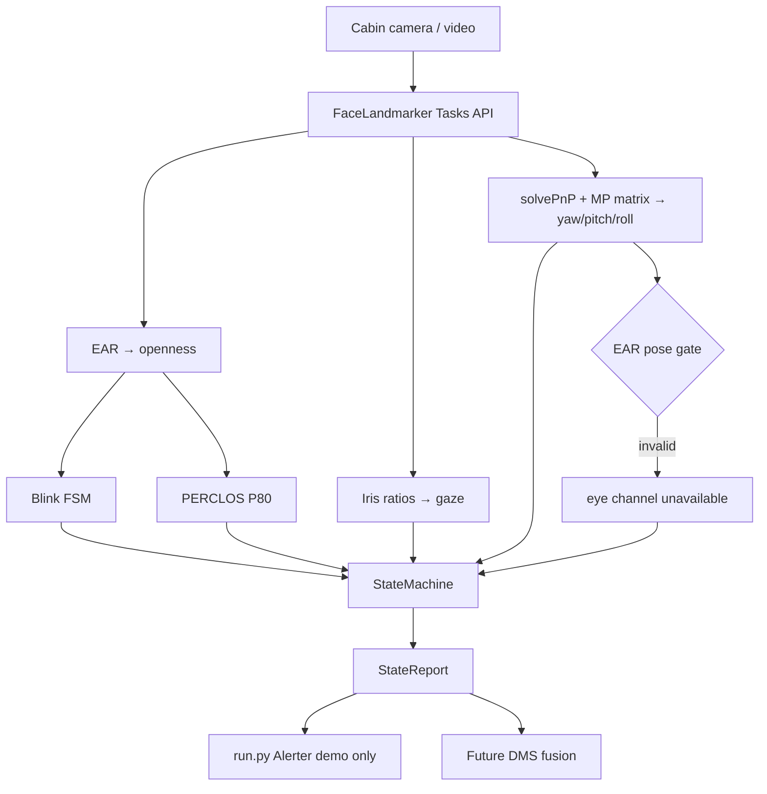

# Face Subsystem (EAR / PERCLOS / Gaze)

↑ [[Home]] | Model index: [[Models Index]]

Camera-side behavioural model: eye closure, blink classification, PERCLOS, gaze
deviation, and head pose from **one** MediaPipe Face Landmarker inference per
frame. Arithmetic after that.

**Code:** `models/face/` — adopted 2026-09-20 from
[`youssefmedhat4/dms-face`](https://github.com/youssefmedhat4/dms-face) commit
`65e3afd` (2026-08-28).

Code contracts: [`models/face/docs/ARCHITECTURE.md`](../models/face/docs/ARCHITECTURE.md) ·
Validation: [`VALIDATION.md`](../models/face/docs/VALIDATION.md) ·
Evidence: [`EVIDENCE.md`](../models/face/docs/EVIDENCE.md) ·
Upstream narrative (kept verbatim): [`UPSTREAM_README.md`](../models/face/docs/UPSTREAM_README.md)

## Why it exists

The report's vision path ([[3.1 System Architecture]], [[3.2 Technical Description]])
needs eyelid / PERCLOS, off-road gaze, and head pose with <1 s component latency
and ≥85–90% accuracy targets. This package is that path for everything that
shares facial landmarks. **Phone usage stays out** — YOLO work will live under
`models/phone/` so it can progress without colliding with this tree.

## Data flow



## Ownership — parallel work with physiology

| Tree | Owner | Safe to edit without coordinating |
|---|---|---|
| `models/face/**` | Youssef | Yes — primary workspace |
| `models/physiology/**` | Ziad | Yes — primary workspace |
| `models/phone/**` | TBD | Not created yet |
| `models/README.md`, root `README.md`, `CLAUDE.md`, [[Models Index]] | Either, **tiny PRs** | Status-row bumps only; never mix with large code PRs |
| Fusion / production alerts | Phase 4 / joint | Do not grow face `alerts.py` into the cabin policy |

**Branching:** feature branches named `face/<topic>` or `physio/<topic>`. Prefer
one subsystem per PR. If a shared doc must change, open a separate one-line PR
after the code lands.

**Conflicts to avoid:** do not move physiology files into face or vice versa;
do not put YOLO phone weights under `models/face/models/`; do not make
`StateReport.should_alert` the production alert API.

## Key design decisions (defendable)

Summarised from upstream; full argument in
[`docs/UPSTREAM_README.md`](../models/face/docs/UPSTREAM_README.md):

- Openness normalisation from calibrated open **and** closed EAR (true P80), not raw EAR / constant.
- Hysteresis (0.20 / 0.30), not a single threshold.
- Durations in **milliseconds**, not frame counts.
- Invalid frames stay in both PERCLOS numerator accounting paths; low validity → unavailable.
- EAR gated on head pose (>~30° yaw discarded).
- Alert threshold 1.5 s prolonged closure (divergence from report's 2–3 s — recorded in ARCHITECTURE).
- MediaPipe Tasks API (`>=1.0`), not legacy `mp.solutions`.

## Fairness

Calibration reports per-driver SNR (`good` / `fair` / `poor`). That distribution
belongs in the ethics chapter ([[4.3 Ethics]]) — a single accuracy headline that
hides who the system fails is not defensible.

## Status

| Item | State |
|---|---|
| Core package + unit tests | **In monorepo** |
| Docker `verify` gate | Added (record first green run in EVIDENCE) |
| Pi 5 throughput table | Open — G4 |
| Concurrent load with physiology | Open — G6 |
| JSON/socket `OutputSink` like physiology | Not yet — next integration step |
| Production alert hand-off | Deferred to Phase 4 |

## Quickstart

```bash
cd models/face
pip install -e ".[dev,bench]"
pytest
python run.py --calibrate
```

Pi: `./install_pi.sh` from the same directory.
