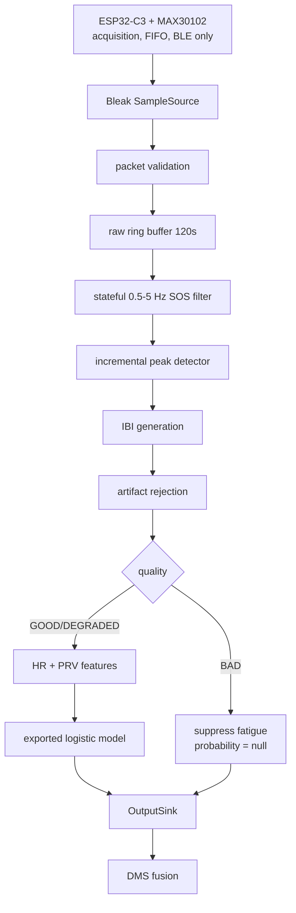

# Physiology Subsystem (HR/PRV)

↑ [[Home]] | Model index: [[Models Index]]

The first of the three DMS models to be implemented. Turns raw wrist PPG from a MAX30102 bracelet
into quality-gated heart rate, pulse-rate variability, and an optional fatigue probability for
[[3.1 System Architecture|decision fusion]].

**Code:** `models/physiology/` — adopted 2026-08-28 from `Z:\Programming\Grad\HR&HRV`
(standalone repo `github.com/ziadteama/HR-HRV`, single commit `3339d58`).

> [!important] PRV, not HRV
> The project deliberately calls this output **PRV** (pulse-rate variability), not HRV. PPG-derived
> variability is not equivalent to ECG-derived HRV, especially during motion or poor optical
> contact. The documentation and any UI must keep this distinction even when numerical agreement is
> good. This is a scientific-honesty constraint, not a naming preference.

## Why it exists

The report's premise ([[1.1 Motivation]]) is that HR/HRV reveals autonomic change *before* visible
eyelid closure — so physiology is an **early** and **confirming** signal for the vision models, and
is what distinguishes RTDMS from the 8 commercial systems surveyed in
[[4.2 Commercial Market Survey]], none of which use a wearable physiological channel.

## Data flow



The processor is **incremental**: it processes each BLE batch once and retains filter state across
batches. It never rescans a full 60-second window per notification — that is what keeps it inside
its Pi budget.

## Hardware boundary

The ESP32-C3 configures the MAX30102, services the FIFO, assigns sample indices, and sends raw data.
It calculates **nothing** — no HR, no PRV, no quality, no fatigue. All derivation happens on the Pi.

Timing comes from `first_sample_index` + `sample_rate_hz`, **never** from BLE notification arrival
time (which is jittery and would corrupt IBI calculation). Arrival timestamps are transport
diagnostics only.

Packet loss, reordering, sequence wraparound, MCU reset, FIFO overflow, and sensor saturation are
treated as **normal operating conditions**, detected and surfaced — never silently bridged with
fabricated samples.

## Code map

| File | LOC | Responsibility |
|---|---:|---|
| `types.py` | 99 | Frozen value objects: `PpgPacket`, `PpgFrame`, `QualityReport`, channel/status/reason flags |
| `protocol.py` | 153 | BLE packet codec, 18-bit sample decoding, `PacketTracker` (loss/reorder/reset detection) |
| `acquisition.py` | 75 | `SampleSource` protocol, `BleakSampleSource` |
| `signal.py` | 173 | `StreamingBandpass`, `AdaptivePeakDetector`, `IntervalRejector`, `FloatRingBuffer` |
| `features.py` | 62 | `FeatureSnapshot`, time-domain HR/PRV feature extraction |
| `quality.py` | 67 | Quality scoring and GOOD/DEGRADED/BAD gate |
| `model.py` | 73 | `LogisticModel` — loads/validates JSON artifact, stable sigmoid |
| `fusion.py` | 43 | `OutputSink` protocol, `InMemorySink`, `UnixDatagramSink` |
| `service.py` | 190 | `PhysiologyService` — single asyncio loop orchestrating all of the above |
| `simulate.py` | 67 | Deterministic synthetic PPG source |
| `config.py` | 54 | `RuntimeConfig` from TOML |

Tools: `tools/train_model.py` (offline training → JSON artifact), `tools/validate_bidmc.py`
(replay a BIDMC record, compare to ECG reference), `tools/benchmark_pi.py` (resource harness).

## Signal-processing defaults

| Item | Default | Rationale |
|---|---:|---|
| Sampling | 100 Hz | Native MAX30102 rate, adequate PRV resolution, low BLE volume |
| Raw history | 120 s | Two analysis windows, minimal memory |
| Detector history | 20 s | Adaptive thresholds without repeated full-window work |
| PRV history | 300 s | Baseline features, optional 5-min analysis |
| HR update | 1 s | Responsive fusion data |
| PRV / model update | 5 s | Timely without redundant work |
| Feature window | 60 s | Responsive HR + short-window RMSSD |
| Filter | 2nd-order Butterworth SOS, 0.5–5 Hz | Removes drift + HF noise, retains causal state |
| Peak detector | Elgendi-style adaptive, 300 ms refractory | Linear-time block detection |
| Valid IBI | 300–2,000 ms | Rejects implausible intervals |

Tunable in `configs/default.toml` — not hardcoded.

## Features

Emitted: `mean_hr_bpm`, `hr_slope_bpm_per_min`, `median_ibi_ms`, `rmssd_ms`, `sdnn_ms`, `pnn50`,
`cvnn`, `valid_interval_count`, `artifact_fraction`.

Fed to the model: the above minus counts, with RMSSD as `log_rmssd = log1p(rmssd_ms)`.

> [!warning] No interpolation
> Rejected intervals are **not** interpolated for primary RMSSD/SDNN. Interpolating would
> manufacture variability that was never measured. Requires ≥3 valid intervals or features return
> `None`.

## Quality gating

`GOOD` / `DEGRADED` / `BAD`, with independent reason bit-flags: `PACKET_LOSS`, `SENSOR_FAULT`,
`CLIPPING`, `ARTIFACTS`, `INSUFFICIENT_BEATS`, `FLATLINE`.

**`BAD` forces `fatigue_probability = null`.** The model is not invoked at all. The subsystem must
be able to say "I don't know" rather than emit a confident wrong number.

Quality metrics **gate** outputs; they are never classifier *features* — otherwise the model could
learn to mistake motion artifacts for fatigue. An ablation is required to confirm this
([[#Open risks]]).

## Output contract & fusion boundary

Unix-domain datagram, JSON payload, schema v1. `InMemorySink` exists for deterministic tests. No
HTTP server.

> [!important] Fusion owns the alert decision
> This subsystem emits a **continuous probability plus quality state**. It never emits an alert.
> Thresholding and alert policy belong to [[3.1 System Architecture|decision fusion]], so a
> numerical score can't be misread as a decision. This matches the report's alert mapping in
> [[3.1 System Architecture]] Table 3-2, where the maximum alert requires *combined* behavioural
> **and** physiological risk.

## Model artifact

Trained with `StandardScaler` + `LogisticRegression`. Runtime loads a **JSON artifact, never a
pickle**. Validation rejects duplicate/unknown/reordered feature names, non-finite values,
zero/negative scales, dimension mismatch, unsupported schema.

`scikit-learn` is a **training-only** dependency and must never enter the runtime path.

## Resource budget (Pi 5)

| Metric | Target | Hard gate |
|---|---|---|
| CPU | < 1% of one core | < 2% |
| RSS | 120 MB | 150 MB |
| P95 feature update | 20 ms | 100 ms |
| End-to-end fusion lag | — | < 250 ms after 5 s boundary |

Runs as a separate systemd service with a memory limit and **lower scheduling priority than the two
CV models**. Must be benchmarked with the CV models actually running — a standalone benchmark
cannot establish DMS readiness.

## Verification

Docker is the canonical environment (guarantees Python 3.11 regardless of workstation):

```bash
cd models/physiology
docker compose run --rm verify     # pytest + ruff + mypy
docker compose run --rm simulate   # 70s synthetic replay
```

> [!success] Verified in-place after adoption — 2026-08-28
> `17 passed` · ruff `All checks passed!` · mypy `no issues found in 12 source files` · exit 0.
> Confirms the monorepo move did not break anything.

## Evidence so far

> [!success] BIDMC clean-signal HR check
> `bidmc_01`: 60,001 PPG samples (480 s) → 504 valid outputs, **HR MAE 0.50 bpm**, 95th-percentile
> absolute error 1.65 bpm, against the record's ECG-derived 1 Hz reference.

That is a controlled *clinical, clean-signal, HR-only* check. It does **not** validate PRV agreement,
wrist motion, MAX30102 sensor-domain transfer, fatigue labels, or Pi performance under CV load.

Target gates before release: peak F1 ≥ 0.98, HR MAE ≤ 3 bpm, IBI MAE ≤ 20 ms on clean windows,
reported **per quality state** — never hidden in one aggregate.

## Status and release gates

| Gate | State |
|---|---|
| Package scaffold, packet codec, streaming signal path | Done |
| Deterministic synthetic simulator + replay source | Done |
| JSON logistic-model loader + validation | Done |
| Unit tests (17), lint, strict typecheck | Done |
| Initial BIDMC HR validation | Done (clean-signal only) |
| Public dataset adapters (PPG-DaLiA, BUT PPG) | **Open** |
| Trained fatigue artifact (LOSO-validated) | **Open** |
| Two-hour long-replay soak | **Open** |
| Concurrent Pi benchmark with both CV models | **Open** |
| Hardware integration (real bracelet) | **Open** |

## Spec vs. implementation gaps

Verified by reading the code against `docs/ARCHITECTURE.md` on 2026-08-28. These are **not bugs in
working code** — they are places the implementation has not yet caught up to its own spec, and each
is a concrete Phase-2 task.

| # | Gap | Evidence |
|---|---|---|
| 1 | **Baseline-deviation features missing.** Architecture requires "rolling HR/RMSSD deviation from a 300-second baseline" as a required feature. `baseline_window_seconds = 300.0` is defined in `config.py:37` and `configs/default.toml:6` but referenced **nowhere** in `src/`, `tools/`, or `tests/`. `FeatureSnapshot` has no baseline field. | `grep -rn baseline` → only the two definitions |
| 2 | **`STALE` state not implemented.** Architecture's failure policy requires emitting `STALE` after a BLE disconnect timeout. The string/enum appears nowhere in `src/`. No disconnect timeout or reconnect backoff exists in `service.py`. | `grep -rn STALE src/` → no matches |
| 3 | **`VALID` state not emitted.** Architecture defines states `WARMUP`/`VALID`/`DEGRADED`/`STALE`. `service.py:125` instead emits `"warmup"` or the *quality* state value (`good`/`degraded`/`bad`), so consumers see a quality vocabulary where a lifecycle state was specified. Fusion must not be written against the doc alone. | `service.py:125` |
| 4 | **Unbounded sink, no drop counting.** Failure policy requires bounding the output queue and counting dropped outputs when fusion is unavailable. `UnixDatagramSink.publish` awaits `sock_sendto` directly with no queue or drop counter; `InMemorySink` appends to an unbounded list despite its "bounded record" docstring. | `fusion.py` |

> [!tip] Worth fixing before fusion work starts
> Gaps 3 and 4 are the ones that will bite during Phase 4 integration: fusion consumes this
> contract, so the state vocabulary and backpressure behaviour should be settled first.

## Open risks

Carried from `docs/VALIDATION.md`, each needing explicit closure:

| Risk | Why it matters | Closure evidence |
|---|---|---|
| Wrist motion without an IMU | Steering + road vibration may make optical PRV unusable | ≥80% usable 60 s windows during representative steering, else add IMU or revise sensor choice |
| Sensor-domain shift | Public BVP data may not match MAX30102 red/IR wrist signals | Validate post-hardware against simultaneous ECG or trusted chest strap |
| Fatigue-label scarcity | Small driving datasets overfit subjects | LOSO results, calibration, CIs; label **experimental** until replicated |
| BLE timing misuse | Jittery notification timing corrupts IBI | Tests prove sample-index timing used end to end |
| Quality leakage | Model could mistake motion for fatigue | Quality gates outputs, not features; ablation confirms |
| Resource contention | May cause CV deadline misses despite low standalone cost | Concurrent Pi benchmark + thermal soak |
| Unsafe fusion semantics | Score misread as alert decision | Nullable probability, quality/state fields, fusion-owned thresholds |

> [!warning] The motion risk is the big one
> This is the risk most likely to invalidate the physiological channel entirely. The report's
> [[4.4 Feasibility and Risk Analysis]] lists "sensor noise" as only *Medium* impact — the
> subsystem's own validation plan treats it as potentially fatal to the approach. Trust the
> stricter assessment.

## Relation to the report

| Report section | Connection |
|---|---|
| [[1.1 Motivation]] | HR drops ~9% with sleepiness; HR/HRV as the early autonomic signal |
| [[1.3 Objective]] | "Stable signal acquisition, consistent BPM estimation, sustained HR trends" |
| [[2.2 Research Gap]] | Table 2-2 recommends Random Forest / SVM; implementation uses **Logistic Regression** — justified by Pi resource budget + calibration, and retained unless a candidate improves LOSO macro-F1 by ≥0.05 **and** AUROC by ≥0.03 while passing the same gates |
| [[3.1 System Architecture]] | §3.1.1 Physiological Monitoring Subsystem; §3.1.2 decision fusion |
| [[3.3 Dataset Selection and Collection]] | Report selects **WESAD**; this subsystem validates against **BIDMC / PPG-DaLiA / BUT PPG** — a broader, signal-validation-first set |
| [[4.5 Cost Calculation and BOM]] | MAX30102 wristband, 95–520 EGP |
| [[5.2 Phase Two Plan]] | Phase 1 (wearable + BLE <100 ms), Phase 2 (fatigue classifier), Phase 4 (fusion) |

> [!note] Two documented divergences from the report
> **Model choice** (Logistic Regression vs. the report's Random Forest/SVM) and **datasets**
> (signal-validation datasets added ahead of WESAD). Both are defensible engineering decisions, but
> the final report should be updated to match what was actually built, or the divergence explained.
